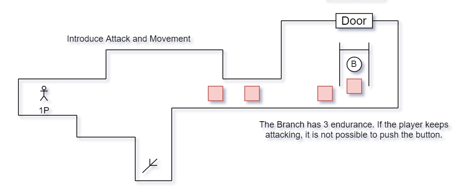

# B&W Game Design Doc

## Overview

+   Genre: 2D dungeon&puzzle

+   Style: funny and cute (prefer vector art)

+   Target Platform: Windows

+   Ages: Above 12

## Introduction

In this game, the player will control a character with a branch as his weapon to explore the dungeon.

+   The Branch has 3 endurance. (-1 for each time you use it)

+   Once running out of it, you will lose the Branch.
+   In many case the Branch is necessary to solve puzzle.

The Branch

+ ATK: 1
+ Endurance: 3

The branch's Endurance will be recharged when the player arrive at a checkpoint.

## A simple start design

## Development Environment

Unity 2020.3.3f1c1 LTS

